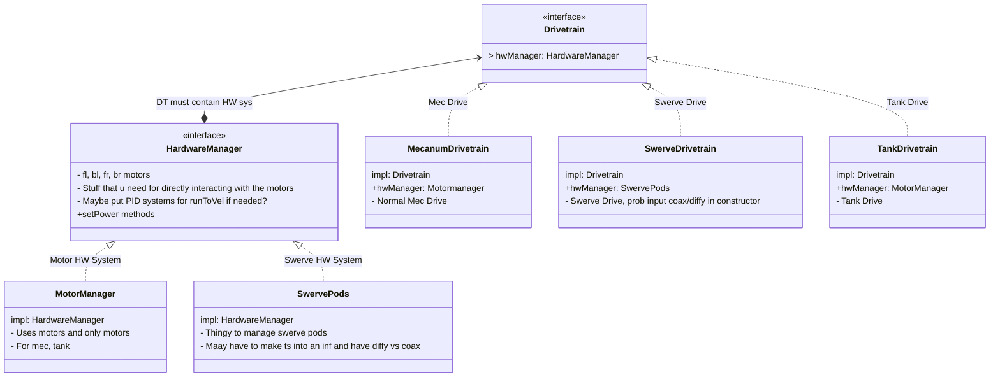

# Pathing Lib Structure

## Drive System


## Localizer System

```mermaid
classDiagram
    class Localizer {
        <<interface>>
        > poseTracker: PoseTracker
        +getPosition(): Pose
        +getVelocity(): Velocity
        +Anything else you need
        - Interacts with physical localization hardware
        - Pose Tracker handles all interactions
        - Most calls should re-direct to pose tracker
        - Extra HWManager might be unnecessary, but maybe helpful for organization??
        - Pinpoint, 2-wheel, 3-wheel + IMU, 3-wheel, Drive Enc, OTOS(its a bum according to xandy)
    }
    class PoseTracker {
        > currPose: Pose
        > currVel: Vector
        - Handles all the math for tracking position directly from localizer
        - Should also be the only part of the localizer to interact with user/other systems
    }
    class PinpointLocalizer {
        impl: Localizer
        > pp: Pinpoint <-- gen custom driver class for ts
        - Maybe add some custom I2C stuff to optimize looptimes
    }
    class TwoWheelLocalizer {
        impl: Localizer
        > forwardPod: OdoPod <-- maybe custom pod class for ts
        > strafePod: OdoPod <-- maybe custom pod class for ts
        - Again, maybe custom I2C stuff
        - Math to track positional stuff
    }
    class ThreeWheelIMULocalizer {
        impl: Localizer
        > forwardPod: OdoPod
        > strafePod: OdoPod
        > thirdPod: OdoPod
        > headingSupplier: IMU
        - Define custom classes
    }
    class ThreeWheelLocalizer {
        impl: Localizer
        > forwardPod: OdoPod
        > strafePod: OdoPod
        > thirdPod: OdoPod
        - Might need to have sm custom inner classes for math
    }
    class DriveEncLocalizer {
        impl: Localizer
        > fl, bl, fr, br: MotorEx <-- prob define custom MotorEncFactory
        - Custom MotorEncFactory to de-limit setPowers from here, and to enhance default methods
    }
    class OTOSLocalizer {
        impl: Localizer
        > OTOSDriver: Localizer
        - IDK if we adding ts bcos xandy said its for bums
        - Define custom class for OTOS handling
    }
    Localizer <|.. PinpointLocalizer : Pinpoint
    Localizer <|.. TwoWheelLocalizer : 2-wheel
    Localizer <|.. ThreeWheelLocalizer : 3-wheel
    Localizer <|.. ThreeWheelIMULocalizer : 3-wheel + IMU
    Localizer <|.. DriveEncLocalizer : Drive Encoder
    Localizer <|.. OTOSLocalizer : OTOS - idk if we doing it
    Localizer <--* PoseTracker : External Affairs.
```


## Higher Level Core Hierarchy
```mermaid
graph Core
    subgraph DriveTrain
        DT[DriveTrain inf]
        MC[Mecanum DriveTrain]
        TK[Tank Drivetrain]
        SW[Swerve Drivetrain]
```
